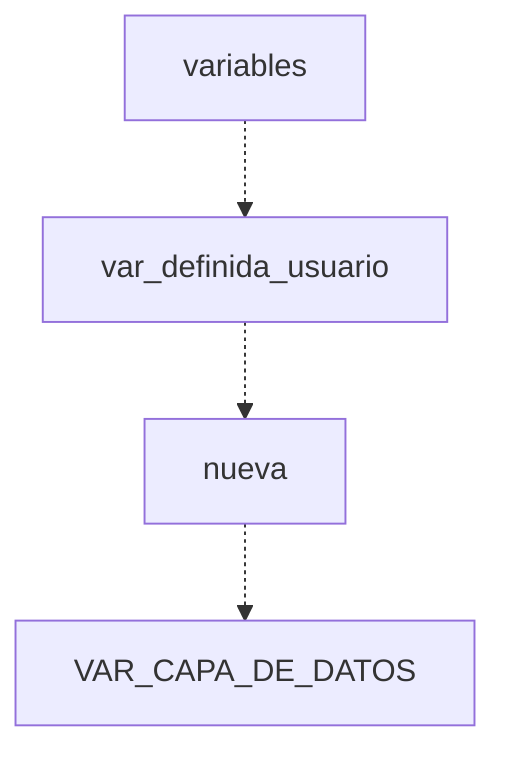
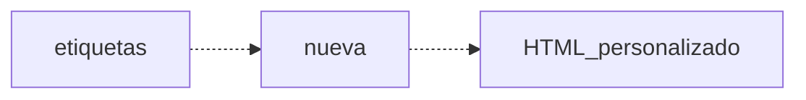

+++
title = "Cómo explotar al máximo el dataLayer de Google Tag Manager: la declaración"
date = 2019-08-08T17:52:54+01:00
draft = false
robots = "index, follow"
url = "/explotar-maximo-datalayer-google-tag-manager-parte-1"
summary = "Hablaremos del core de google tag manager, el dataLayer o variable de capa de datos más importante para declarar las variables y/o escalar nuestras bases de esta herramienta de medición."

# Tags and categories
# For example, use `tags = []` for no tags, or the form `tags = ["A Tag", "Another Tag"]` for one or more tags.
tags = ["formacion big data", "escuelas negocio", "big data"]
categories = ["Tag Manager"]
authors = ["marcusRB"]


# Featured image
# To use, add an image named `featured.jpg/png` to your page's folder.
[image]
  # Caption (optional)
  caption = ""

  # Focal point (optional)
  # Options: Smart, Center, TopLeft, Top, TopRight, Left, Right, BottomLeft, Bottom, BottomRight
  focal_point = ""
+++

Cuando hablamos de **Google Tag Manager** pensamos en la gestión organizada de etiquetas, pixel de conversiones, mediciones de eventos para Google Analytics, etc., pero casi nunca nos paramos a pensar como está creado, y cuales son sus secretos más allá de ser el *core* de GTM.

```
# Aquí está parte de sus secretos, la declaración inicial en su script del <head>
<script>
...

dl=l!='dataLayer'?'&l='+l:'';j.async=true;j.src=
'https://www.googletagmanager.com/gtm.js?id='+i+dl;f.parentNode.insertBefore(j,f);
})(window,document,'script','dataLayer','GTM-XXXX');
</script>

```

Bien, después de muchos años que he estado utilizando esta fantástica [herramienta de gestión de etiquetas](../google-tag-manager-10-buenas-razones-para-usarlo-bien/), hemos llegado a poder "dominarlo" en parte, existen muchos tutoriales, pero cuando se complican las cosas, siempre necesitaremos gran parte del trabajo de un **desarrollador front / back-end**, con lo cuál, tendremos que considerar:
- JavaScript
- jQuery
- CSS
- HTML
- analítica digital
- CRO y testing AB
- fundamentos de desarrollo de POO (Programación Orientado a Objetos)
- etc.

pero hay otra parte que también un *analista experimentado* podrá realizar directamente en la interfaz de GTM, jugar con el **dataLayer**, y sacar todos su potencial.

## Qué es el dataLayer?

Si queremos buscar una definición, yo me quedaría con la mía:

> la variable de dataLayer es uno script en lenguaje JSON declarado dentro del contenedor principal de Google Tag Manager que nos ayuda a comunicar directamente desde el sitio web / aplicación móvil hacía la interfaz o viceversa, con la herramienta de análisis o medición. El formato JSON está compuesto de un objeto o listado de objetos, de par *parámetro* y *valor*.

```
dataLayer({
  "nombre_variable_x" : "cadena texto",
  "numérico_y": 50,
  "booleano": true,
  "listado": [{
    "obj1": 5,
    "obj2": "hola",
    "obj3": false

    }]
  });

```
Prácticamente almacena la información, sea un evento de un botón, de un formulario, acción etc, y para su uso podemos o bien llamar la variable en GTM, o en caso específico de Google Analytics, enviarlas directamente si está en el formato adecuado, como el comercio electrónico mejorado.


Este es el ejemplo del *comercio electrónico mejorado de Google Analytics*:

```
# evento de click en productos

dataLayer.push({
  "event": "productClick",
  "ecommerce": {
    "click": {
      "actionField": {
        "list": "homepage"
      },
      "products": [{
        "id": "b55da",
        "name": "Flexigen T-Shirt",
        "price": "16.00",
        "brand": "Flexigen",
        "category": "T-Shirts",
        "position": "3"
      }]
    }
  }
});
```

Si has llegado hasta aquí, pero no conoces mucho de GTM, entonces te recomiendo esta pequeña recopilación que he redactado, son pequeños tutoriales y fundamentos de Google Tag Manager:

* [tag manager](/categories/tag-manager/)


## Cómo puedo crear mi propio dataLayer?

La pregunta no es sencilla. Primero has de tener el acceso a tus archivos o servidor para poder implementar el dataLayer personalizado. Es muy importante que el dataLayer esté por *encima* del script principal de GTM.

```
# Así debería ser tu estructura con el dataLayer personalizado

<HTML>
  <HEAD>
...
<script>
var dataLayer = window.dataLayer || [];
      dataLayer.push({
        'event' : 'productData',
        'name': '',
        'brand': '',
        'category':'{$category}',
        'id': '',
        'sku': '',
        'stock':'',
        'amountPrice' : '',
        'regularPrice' : '',
        'quantity' : '1'

      });
</script>
<!-- Google Tag Manager -->
<script>(function(w,d,s,l,i){w[l]=w[l]||[];w[l].push({'gtm.start':
new Date().getTime(),event:'gtm.js'});var f=d.getElementsByTagName(s)[0],
j=d.createElement(s),dl=l!='dataLayer'?'&l='+l:'';j.async=true;j.src=
'https://www.googletagmanager.com/gtm.js?id='+i+dl;f.parentNode.insertBefore(j,f);
})(window,document,'script','dataLayer','GTM-XXXXXX');</script>
<!-- End Google Tag Manager -->
...


  </HEAD>
<BODY>
</BODY>

```

Si te fijas, viene primero la declaración de la variable dataLayer, sucesivamente hay un estado **push** donde desde el sitio web estamos *enviando* la información a quién quiera disponerla. Sucesivamente hay el script principal de GTM.


### Cómo puedo llamar las variables del dataLayer

Esta parte ya es más práctica. Si conocemos nuestra interfaz, ya sabemos que su composición es:
- etiquetas
- activadores
- variables

Entonces para poder crear la variable de capa de datos tenemos que seguir estos pasos:



Aquí ya tenemos nuestra libertad de llamar nuestra variable del dataLayer, por ejemplo si introducimos:

*category*

nos dará la información de la categoría, siempre y cuando esta será populada con un valor, en caso contrario tendríamos: **undefined**


 IMAGEN DATALAYER category

## Puedo crear mi propio dataLayer desde la interfaz?

Sí y no. Podemos siempre manipular la información del dataLayer principal, o hasta incluso crear nuestro dataLayer personalizado desde la interfaz, y para ello, tenemos que tener cuidado de no hacer crear ni bucles, ni errores de servidor, 5xx o de página 4xx.

Tenemos solo que ir en:



y introducimos este pequeño script que a continuación es declaración del dataLayer:

```
<script>
var dataLayer = window.dataLayer || [];
dataLayer.push({
  	'event': 'fireDataLayer',
});
</script>


```


Si pongamos como *ACTIVADOR* una página vista cualquiera, tendremos la ejecucción del evento **fireDataLayer** que a su vez podemos incluir más informaciones y más variables.


## Ejemplo Google Remarketing Tag

Un ejemplo podría ser un pixel de conversión a medida o por ejemplo personalizar la etiqueta de remarketing de Google Ads. Este es solo un ejemplo que a la vez necesitaremos de más variables y más detalles.

```
# Exactamente la continuación del ejemplo de arriba

<script>
var dataLayer = window.dataLayer || [];
dataLayer.push({
  	'event': 'fireRemarketingTag',
    	'google_tag_params': {
    		'ecomm_prodid': '{{dlv - productId}}',
			'ecomm_pagetype' : '{{dlv - productPageType}}',
			'ecomm_totalvalue' : {{dlv - productPrice}}
    }
});
</script>


```

Te has fijado en las tres variables *dlv* ?
Buenos podemos también crear **funciones CUSTOM JS** como variables y recoger las informaciones y pasarla al dataLAyer, y estas pasarlas a Google Ads.

Esté atento al próximo tutorial
